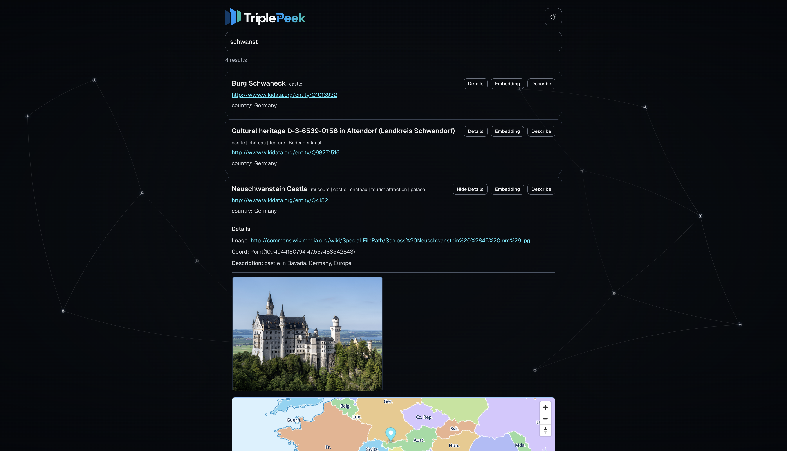

# Getting Started

Requirements:

* Git
* Docker
* Docker Compose

Clone the project:

```bash
git clone https://github.com/AlbertKhomich/triple-peek
cd triple-peek
```

Create the environment file:

```bash
cp .env.example .env
```

The repository includes a ready-to-run Wikidata demo. 
<details>
  <summary>Show demo-screenshot</summary>

  <br>

  
</details>
<br>


Start it:

```bash
docker compose build
docker compose up -d db
docker compose run --rm seed
docker compose up -d app
```

Open:

```text
http://localhost:3000
```

After the initial setup, start TriplePeek with:

```bash
docker compose up -d db app
```

Stop it with:

```bash
docker compose down
```

## Try It With Your Own Knowledge Graph

Once the demo is running, you can point TriplePeek at your own SPARQL endpoint.

### 1. Configure your endpoint

Set your endpoint and catalog path in `.env`:

```env
SPARQL_ENDPOINT=https://example.org/sparql
CSV_FILE=/src/app/data/search-catalog.csv
```

### 2. Create the search catalog

Edit:

```text
src/app/data/create-catalog.sparql
```

for your dataset.

The query must return:

```text
iri
label
```

and may return additional columns containing searchable metadata; `typeLabel` on third place would be great!

Generate the catalog:

```bash
docker compose build prepare-catalog
docker compose run --rm prepare-catalog --page-size 1000 --max-rows 10000
```

For more precise or domain-specific search behavior, you can also create the catalog CSV manually.

### 3. Configure query buttons

The demo includes query buttons configured for its Wikidata dataset.

They are stored in:

```text
src/app/data/buttons/
```

Remove the demo `.sparql` files if they are not applicable to your endpoint, or replace them with queries for your own dataset.

For example:

```text
src/app/data/buttons/
  details.sparql
  related.sparql
```

Use `<${iri}>` in a query wherever the selected search result should be inserted.

For example:

```sparql
PREFIX schema: <http://schema.org/>

SELECT ?name ?description
WHERE {
  OPTIONAL {
    <${iri}> schema:name ?name .
  }

  OPTIONAL {
    <${iri}> schema:description ?description .
  }
}
```

Each `.sparql` file creates a button automatically. You can also leave the directory empty if you only want the built-in **Describe** action.

### 4. Import the catalog

Reset the demo search database and import your catalog. **The `down -v` command deletes the existing database volume and all catalog data.** To retain existing entries, use the [update import](search-catalog.md#update-an-existing-catalog) instead:

```bash
docker compose down -v
docker compose up -d db
docker compose run --rm seed
```

### 5. Start TriplePeek

```bash
docker compose up -d --build app
```

Open:

```text
http://localhost:3000
```

You now have TriplePeek running against your own knowledge graph.
