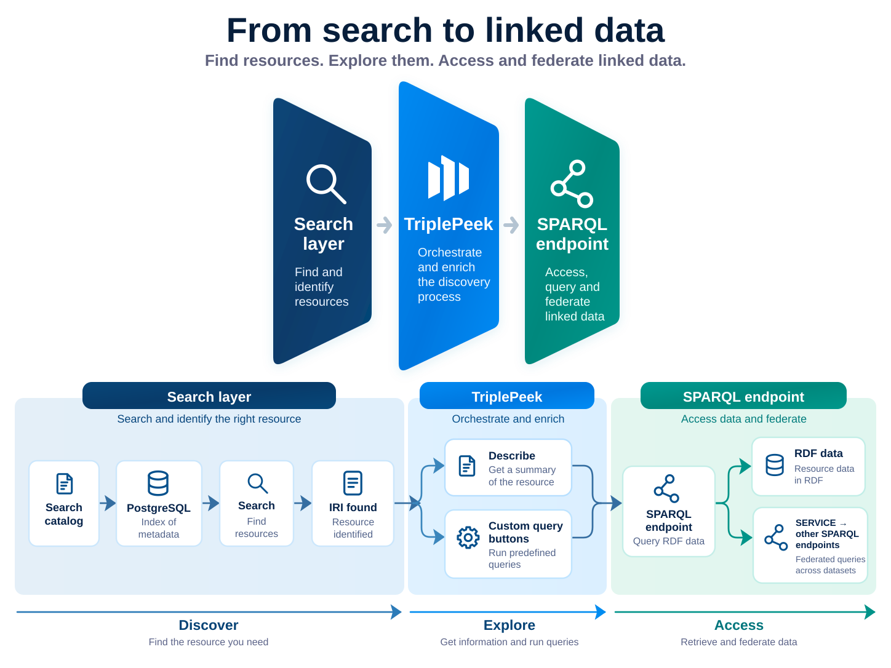

TriplePeek is a lightweight search frontend for SPARQL knowledge graphs.

It combines a PostgreSQL search catalog for fast entity discovery with configurable SPARQL queries for retrieving live RDF data.

## Get started

- [Quick Start](getting-started.md)
- [Search Catalog](search-catalog.md)
- [Automatic Catalog Generation](catalog-generation.md)
- [Query Buttons](query-buttons.md)
- [Configuration](configuration.md)

## What TriplePeek does

- Fast entity search using a local catalog
- Live SPARQL queries against your endpoint
- Configurable query buttons
- Automatic catalog generation from SPARQL endpoints

## How It Works

  

TriplePeek does not query the SPARQL endpoint for every search keystroke.

Instead, searchable entity metadata is stored locally in PostgreSQL. Search returns an IRI, and that IRI becomes the anchor for live queries against the configured SPARQL endpoint.

This keeps text search fast while leaving the RDF data in its original knowledge graph.

The search catalog can remain intentionally small and optimized for discovery even when the underlying knowledge graph is very large.
